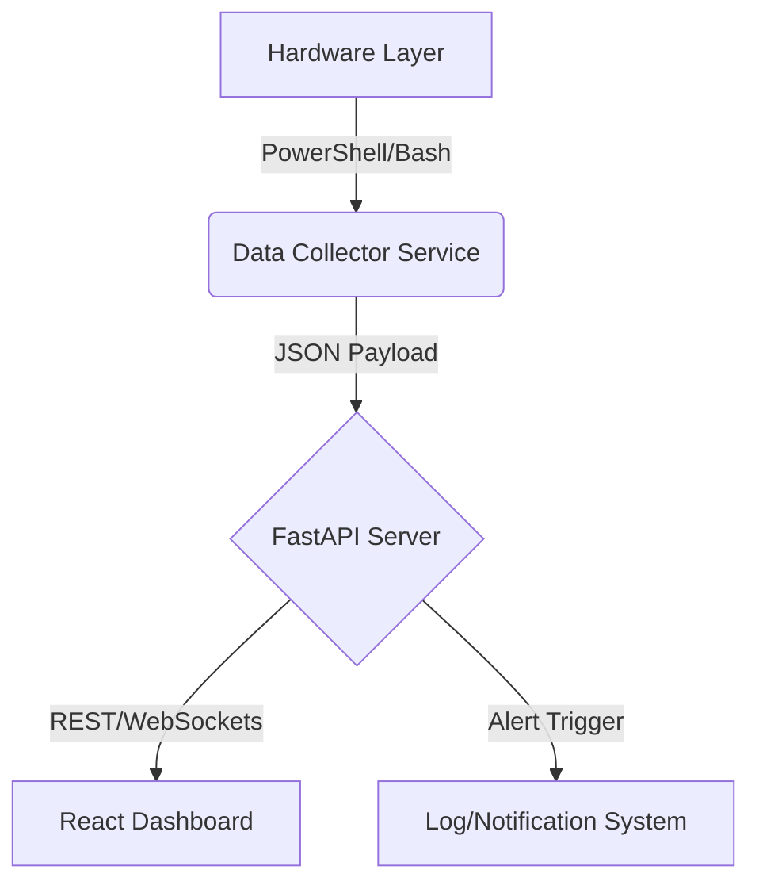

# 📊 System Health Monitor (Enterprise Edition)

A professional-grade, cross-platform infrastructure monitoring solution designed to track critical hardware metrics in real-time. Built with a **decoupled architecture**, it features a high-performance **FastAPI** backend and a responsive **React/Vite** dashboard.

## 🚀 Key Engineering Features

*   **Cross-Platform Architecture:**
    *   **Windows:** Custom **PowerShell** collectors using WMI/CIM for granular hardware access.
    *   **Linux:** Lightweight **Bash** daemons parsing `/proc` filesystem efficiently.
*   **Real-Time Telemetry:**
    *   Live WebSocket/Polling feeds for **CPU Usage, RAM Commitment, and IOPS**.
    *   Visualized using **Chart.js / Recharts** for immediate anomaly detection.
*   **Config-Driven Core:**
    *   Thresholds and polling intervals defined in `config/settings.yaml` (Infrastructure-as-Code principles).
*   **Microservice-Ready:** Separate Frontend and Backend services containerizable for scalable deployment.

## 🛠️ Tech Stack

| Component | Technology | Role |
| :--- | :--- | :--- |
| **Backend** | Python 3.9+, FastAPI | REST API, Data Processing, Alert Logic |
| **Frontend** | React, Vite, TailwindCSS | Reactive User Interface |
| **Collectors** | PowerShell Core, Bash | Hardware-level Data Extraction |
| **Config** | YAML | Dynamic Configuration |

##  Architecture Overview



##  Screenshots


*Real-time Operational Dashboard*


*Detailed Hardware Resource Analysis*

## 🛠️ Installation & Setup

### 1. Backend Service (API)
```bash
# Clone
git clone https://github.com/dineshingale/System-health-monitor.git
cd System-health-monitor

# Virtual Env & Dependencies
python -m venv .venv
# Windows: .venv\Scripts\Activate.ps1
# Linux: source .venv/bin/activate
pip install -r requirements.txt

# Start API Server
python -m uvicorn src.server:app --reload
```
*Server listening on `http://localhost:8000`*

### 2. Frontend Service (Dashboard)
```bash
cd dashboard
npm install
npm run dev
```
*UI accessible at `http://localhost:5173`*

## 📁 Repository Structure
```
System-health-monitor/
├── src/
│   ├── collectors/       # Native OS scripts (Hardware Interface)
│   ├── server.py         # Main API Gateway
│   └── processing/       # Data Normalization Logic
├── config/               # YAML Configurations
├── dashboard/            # React Source Code
└── tests/                # Unit Tests for API endpoints
```

## 🤝 Contributing
We welcome contributions that improve efficiency or add new hardware support.
1.  Fork & Clone
2.  Create Feature Branch (`git checkout -b feature/gpu-support`)
3.  Commit Changes (`git commit -m 'feat: Add NVIDIA GPU monitoring'`)
4.  Push & PR

---
*Demonstrating expertise in Hardware Abstraction, API Design, and Full Stack Development.*
